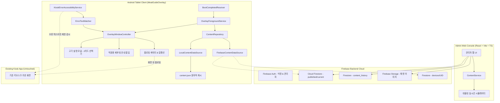

# MeatGuideOverlay 시스템 아키텍처 명세서 (Architecture)

## 1. 시스템 전체 구조도

---

## 2. 주요 모듈 및 레이어 구성

### 2.1 Android 클라이언트 계층 (`android/app`)
1. **Overlay Layer (`com.antigravity.meatguideoverlay.ui.overlay`)**:
   * `OverlayWindowController`: `WindowManager`를 통해 시스템 오버레이 윈도우 생명주기 관리.
   * `FloatingCharacterView`: 화면 모서리 자석 스냅(DecelerateInterpolator), DataStore 위치 영구 저장.
   * `MeatGuideDialog`: 2개 카드(돼지고기 특수부위 / 소생갈비살) 모달, 60초 무입력 자동 닫기 타이머.
   * `KioskErrorDialog`: 키오스크 장애 시 직원 호출 및 전원 메뉴 안내창.
2. **Service Layer (`com.antigravity.meatguideoverlay.service`)**:
   * `OverlayForegroundService`: 상주 백그라운드 서비스 및 알림 관리.
   * `KioskErrorAccessibilityService`: 지정된 키오스크 패키지만 감시하는 경량 접근성 서비스 (최대 깊이 12, 최대 60개 노드로 제한하여 CPU 소모율 극소화).
3. **Data Layer (`com.antigravity.meatguideoverlay.data`)**:
   * `ContentRepository`: 로컬 캐시와 원격 Firestore 동기화 조율, 유효성 검사.
   * `LocalContentDataSource`: 원자적(Atomic) `.tmp` 파일 쓰기 및 교체.
   * `FirebaseContentDataSource`: 익명 인증 및 실시간 스냅샷 리스너.

### 2.2 가상 테스트 키오스크 (`android/test-kiosk`)
* 실제 매장 주문 키오스크의 주문 플로우를 모사하여 캐릭터 오버레이 간섭 여부, 팝업 열림/닫힘, 오류 문구 감지 및 5분 쿨다운을 완벽히 검증할 수 있는 디버그 모듈.

### 2.3 관리자 웹 콘솔 (`admin-web`)
* React 18, TypeScript, Vite 기반 한국어 모던 콘솔.
* 실시간 태블릿 시뮬레이터, 초안 저장, 버전 히스토리 스냅샷 복원, 소고기 단일 품목 유효성 검사, 원클릭 배포 지원.
