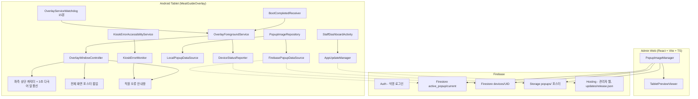

# MeatGuideOverlay 시스템 아키텍처

## 1. 전체 구조

---

## 2. Android 앱 (`android/app`)

### 2.1 화면 (`ui`)
* `OverlayWindowController`: WindowManager로 캐릭터·포스터 팝업·오류 안내창을 관리합니다. 캐릭터는 좌측 상단에 고정되고, 말풍선은 3초마다 언어가 바뀝니다. 포스터는 백그라운드에서 디코딩하며 최대 10MP로 제한합니다(`PosterSampling`).
* `ZoomableTouchImageView`: 포스터 1~5배 확대·이동.
* `SetupWizardActivity`, `StaffDashboardActivity`: 최초 설정과 직원용 관리 화면.

### 2.2 서비스 (`service`)
* `OverlayForegroundService`: 상주 서비스. 설정 변경을 받아 화면 켜짐 유지, 기기 상태 보고(5분 주기)를 처리합니다.
* `KioskErrorAccessibilityService`: 선택한 키오스크 앱의 화면 텍스트만 읽습니다(깊이 12, 60개 노드 제한). 시스템 전원 메뉴도 이 서비스로 엽니다.
* `KioskErrorMonitor`: 이벤트를 400ms 단위로 모아 마지막 화면을 한 번 더 검사하고, 오류 문구가 보이면 5분 쿨다운을 거쳐 메인 스레드에서 안내창을 띄웁니다.

### 2.3 데이터 (`data`)
* `PopupImageRepository`: Firestore 스냅샷을 받아, 포스터 주소가 바뀐 언어만 내려받고 모두 준비된 뒤 새 버전을 적용합니다. 실패하면 30초~10분 간격으로 재시도합니다.
* `LocalPopupDataSource`: 설정(`active_popup.json`)과 언어별 포스터 캐시, 포스터 출처 기록(`ImageSourceRecord`).
* `FirebasePopupDataSource`: 익명 인증, 실시간 리스너, 서버 직접 조회, 포스터 다운로드.
* `DeviceStatusReporter`: `devices/{uid}`에 이름·앱 버전·콘텐츠 버전 보고.

### 2.4 기타
* `AppUpdateManager`: `release.json` 확인, SHA-256 검증 후 Android 설치 화면 실행.
* `DevicePowerScheduler`, `DailyRebootReceiver`: 예전 자동 재부팅 예약을 취소하는 용도로만 남아 있습니다(재부팅 기능은 v1.0.17부터 중지).
* `ContentSyncWorker`: 현재 예약되지 않습니다.

## 3. 가상 테스트 키오스크 (`android/test-kiosk`)
주문 화면과 서버 연결 끊김 팝업을 흉내 내는 테스트용 앱입니다.

## 4. 관리자 웹 (`admin-web`)
React 18 + TypeScript + Vite. 포스터 업로드, 말풍선 자동 번역, 팝업 자동 닫힘 설정, 태블릿 현황, 미리보기를 제공합니다.
